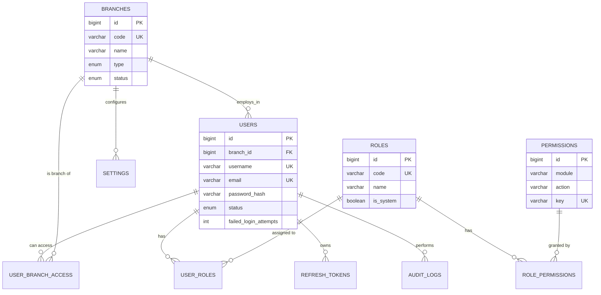

# Database ERD (Mermaid)

The schema is MySQL 8 / InnoDB / utf8mb4. All business tables carry `branch_id`.

## System, auth & multi-location



## Accommodation (Module 1)

```mermaid
erDiagram
    BRANCHES ||--o{ ROOM_TYPES : hosts
    BRANCHES ||--o{ ROOMS : hosts
    ROOM_TYPES ||--o{ ROOMS : types
    BRANCHES ||--o{ GUESTS : hosts
    GUESTS ||--o{ RESERVATIONS : books
    ROOMS ||--o{ RESERVATIONS : reserved_for
    USERS ||--o{ RESERVATIONS : created_by
    RESERVATIONS ||--o{ CHECKINS : checkin
    GUESTS ||--o{ CHECKINS : stays
    ROOMS ||--o{ CHECKINS : assigned
    CHECKINS ||--o{ CHECKOUTS : checkout
    CHECKINS ||--o{ ROOM_TRANSACTIONS : charges
    ROOMS ||--o{ AVAILABILITY_CALENDAR : availability
    RESERVATIONS ||--o{ AVAILABILITY_CALENDAR : blocks

    ROOM_TYPES { bigint id PK; bigint branch_id FK; varchar name; decimal base_rate }
    ROOMS { bigint id PK; bigint room_type_id FK; varchar room_number; enum status }
    GUESTS { bigint id PK; bigint branch_id FK; varchar first_name; varchar last_name; boolean vip }
    RESERVATIONS { bigint id PK; bigint guest_id FK; bigint room_id FK; date check_in; date check_out; enum status; decimal deposit }
    CHECKINS { bigint id PK; bigint reservation_id FK; bigint guest_id FK; bigint room_id FK; enum status }
    CHECKOUTS { bigint id PK; bigint checkin_id FK; decimal room_charges; decimal total; decimal balance }
    ROOM_TRANSACTIONS { bigint id PK; bigint checkin_id FK; enum type; decimal amount }
    AVAILABILITY_CALENDAR { bigint id PK; bigint room_id FK; date date; enum status; bigint reservation_id FK }
```

## Restaurant POS (Module 2)

```mermaid
erDiagram
    BRANCHES ||--o{ CATEGORIES : ""
    CATEGORIES ||--o{ PRODUCTS : contains
    CATEGORIES ||--o{ CATEGORIES : "parent/child"
    BRANCHES ||--o{ TABLES : ""
    BRANCHES ||--o{ ORDERS : ""
    TABLES ||--o{ ORDERS : "dine at"
    GUESTS ||--o{ ORDERS : requests
    ROOMS ||--o{ ORDERS : "room service"
    USERS ||--o{ ORDERS : "created by"
    ORDERS ||--o{ ORDER_ITEMS : has
    PRODUCTS ||--o{ ORDER_ITEMS : lines
    ORDERS ||--o{ KOT_ORDERS : "kitchen"
    ORDER_ITEMS ||--o{ KOT_ITEMS : ""
    KOT_ORDERS ||--o{ KOT_ITEMS : ""
    ORDERS ||--o{ PAYMENTS : settled
    CHECKINS ||--o{ PAYMENTS : settled
    ORDERS ||--o{ DELIVERIES : dispatched

    PRODUCTS { bigint id PK; bigint category_id FK; varchar sku; decimal price; decimal cost; varchar kitchen_station }
    ORDERS { bigint id PK; enum order_type; enum source; varchar external_order_id; decimal grand_total; enum payment_status }
    ORDER_ITEMS { bigint id PK; bigint order_id FK; bigint product_id FK; decimal qty; decimal unit_price }
    KOT_ORDERS { bigint id PK; bigint order_id FK; int kot_number; enum status }
    PAYMENTS { bigint id PK; decimal amount; enum method; bigint order_id FK; bigint checkin_id FK }
    DELIVERIES { bigint id PK; bigint order_id FK; enum status }
```

## Catering & Events (Module 4)

```mermaid
erDiagram
    BRANCHES ||--o{ EVENT_PACKAGES : ""
    BRANCHES ||--o{ EVENTS : ""
    GUESTS ||--o{ EVENTS : books
    EVENT_PACKAGES ||--o{ EVENTS : package
    BRANCHES ||--o{ QUOTATIONS : ""
    GUESTS ||--o{ QUOTATIONS : quoted_to
    EVENTS ||--o{ QUOTATIONS : "converts to (nullable)"
    EVENTS ||--o{ EVENT_PAYMENTS : payments

    EVENTS { bigint id PK; enum event_type; date event_date; int no_of_guests; enum status; decimal total }
    QUOTATIONS { bigint id PK; enum event_type; date event_date; json line_items_json; decimal total; enum status }
```

## Inventory & Purchasing (Module 5)

```mermaid
erDiagram
    BRANCHES ||--o{ SUPPLIERS : ""
    BRANCHES ||--o{ INVENTORY : ""
    SUPPLIERS ||--o{ PURCHASE_ORDERS : supplies
    BRANCHES ||--o{ PURCHASE_ORDERS : ""
    PURCHASE_ORDERS ||--o{ PURCHASE_ORDER_ITEMS : ""
    INVENTORY ||--o{ PURCHASE_ORDER_ITEMS : ordered
    BRANCHES ||--o{ GRN : ""
    PURCHASE_ORDERS ||--o{ GRN : "receives against"
    GRN ||--o{ GRN_ITEMS : ""
    INVENTORY ||--o{ GRN_ITEMS : received
    INVENTORY ||--o{ STOCK_TRANSACTIONS : movement
    PRODUCTS ||--o{ RECIPES : recipe_of
    BRANCHES ||--o{ RECIPES : ""
    RECIPES ||--o{ RECIPE_ITEMS : ""
    INVENTORY ||--o{ RECIPE_ITEMS : ingredients

    PURCHASE_ORDERS { bigint id PK; varchar po_number; date order_date; enum status; decimal total }
    GRN { bigint id PK; varchar grn_number UNIQUE; date received_date; enum status }
    STOCK_TRANSACTIONS { bigint id PK; enum type; decimal qty; varchar reference_type; bigint reference_id }
    RECIPES { bigint id PK; bigint product_id FK; decimal yield_qty }
```

## HR & Payroll (Module 6)

```mermaid
erDiagram
    BRANCHES ||--o{ EMPLOYEES : ""
    USERS ||--o{ EMPLOYEES : "linked login (nullable)"
    EMPLOYEES ||--o{ ATTENDANCE : ""
    EMPLOYEES ||--o{ LEAVE_REQUESTS : ""
    USERS ||--o{ LEAVE_REQUESTS : approved_by
    BRANCHES ||--o{ PAYROLL : ""
    USERS ||--o{ PAYROLL : approved_by
    PAYROLL ||--o{ SALARY_DETAILS : ""
    EMPLOYEES ||--o{ SALARY_DETAILS : ""

    EMPLOYEES { bigint id PK; varchar employee_code UK; varchar department; enum status; decimal basic_salary }
    ATTENDANCE { bigint id PK; bigint employee_id FK; date work_date; enum status; enum method }
    PAYROLL { bigint id PK; date period_start; date period_end; enum status; decimal total_net }
    SALARY_DETAILS { bigint id PK; bigint payroll_id FK; bigint employee_id FK; decimal epf_employee; decimal epf_employer; decimal etf_employer; decimal net_pay }
```

## Finance (Module 7)

```mermaid
erDiagram
    EXPENSE_CATEGORIES ||--o{ EXPENSES : ""
    BRANCHES ||--o{ EXPENSES : ""
    BRANCHES ||--o{ CASH_RECONCILIATIONS : ""
    USERS ||--o{ CASH_RECONCILIATIONS : counted_by
    BRANCHES ||--o{ BANK_TRANSACTIONS : ""
    BRANCHES ||--o{ BANK_RECONCILIATIONS : ""

    EXPENSES { bigint id PK; bigint category_id FK; decimal amount; date paid_at }
    CASH_RECONCILIATIONS { bigint id PK; date reconciliation_date; decimal expected_cash; decimal counted_cash; decimal variance }
    BANK_RECONCILIATIONS { bigint id PK; date period_start; date period_end; decimal opening_balance; decimal closing_balance }
```

## Naming note
The checkout table is named **`checkouts`** (plural) intentionally — `checkout` is a MySQL
reserved word. This is consistent across migrations, repositories and the API.